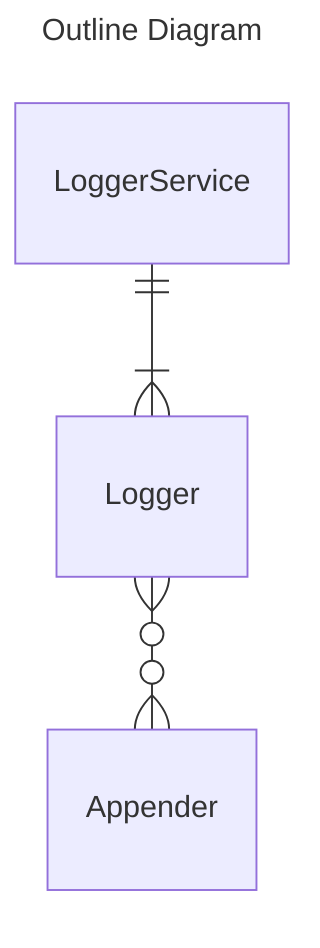

# NgLogback

Logger Service for Angular inspired by Logback.

This project was generated with [Angular CLI](https://github.com/angular/angular-cli) version 18.2.1.

## Overview

| Class | Role |
| ---- | ---- |
| LoggerService | Singleton service for managing Loggers. |
| Logger | Manage and log Appenders. |
| Appender | Define output destination and append log. |

## Appenders

List of Appenders library provides:
- Console Appender
- HTTP POST Appender
    - dependencies: [@angular/common/http](https://www.npmjs.com/package/@angular/common)
- IndexedDB Appender
- LocalStorage Appender
    - dependencies: [uuid](https://www.npmjs.com/package/uuid)
- Google Analytics Appender
- Google Analytics for Firebase Appender
    - dependencies: [firebase/analytics](https://www.npmjs.com/package/@firebase/analytics)

## Development server

Run `npm run start` for a dev server.

## Build

Run `npm run build ng-logback` to build the project. The build artifacts will be stored in the `dist/` directory.

## Running unit tests

Run `npm run test` to execute the unit tests via [Karma](https://karma-runner.github.io).
